## Часть 1. Настройка gitlab-runner
Подними виртуальную машину Ubuntu Server 22.04 LTS 
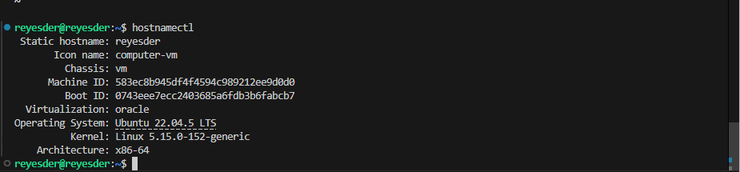

Скачай и установи на виртуальную машину gitlab-runner
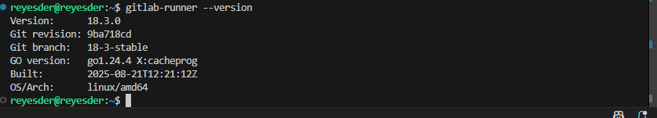

Запусти gitlab-runner и зарегистрируйте его для использования в текущем проекте ( DO6_CICD ).
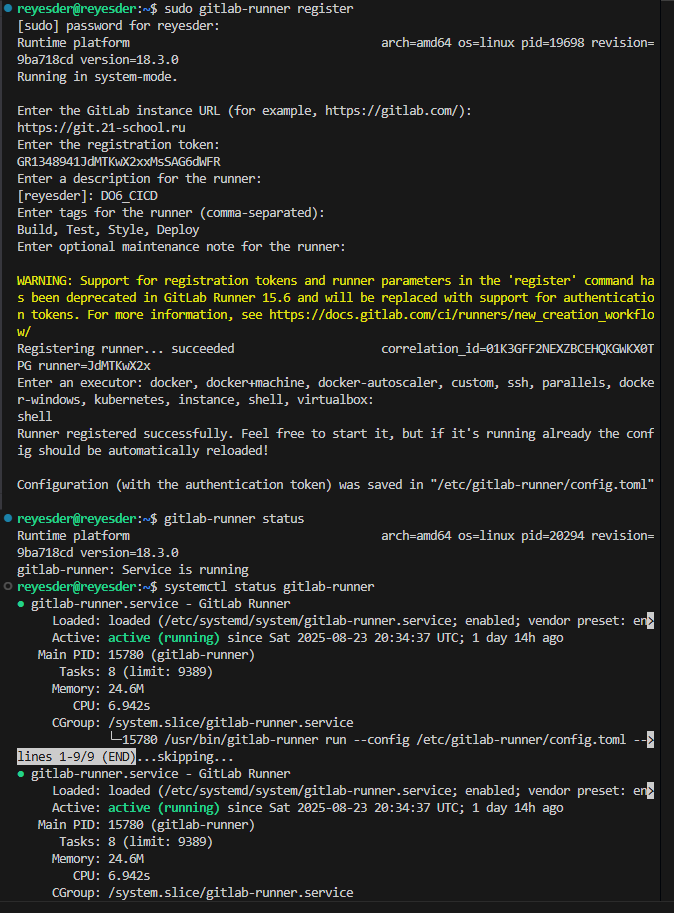

## Часть 2. Сборка
Напишите этап для CI по сборке приложений из папок с примерами кода DO .
В файле .gitlab-ci.yml добавьте этап запуска сборки через создание файла из папок примеров кода.
Файлы, полученные после сборки (артефакты), сохраняются в произвольной директории со сроком хранения 30 дней.
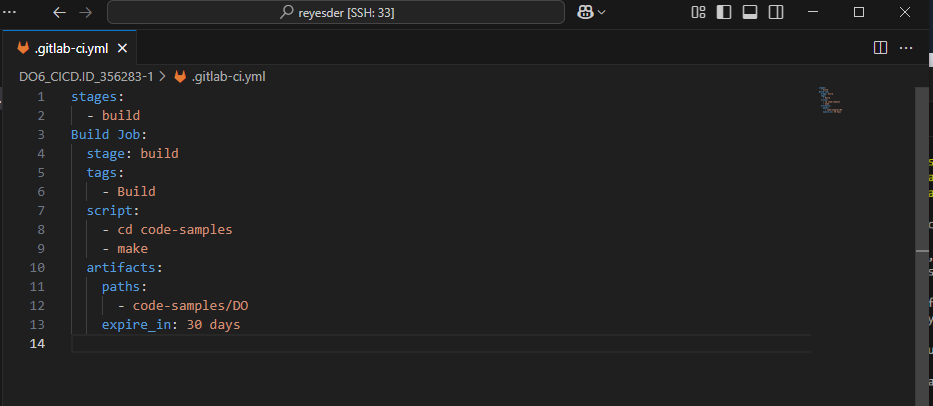
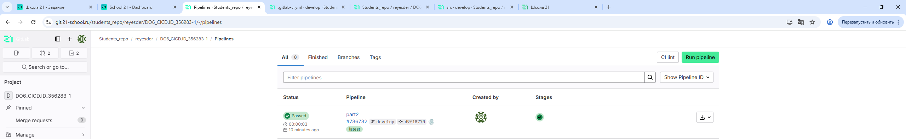
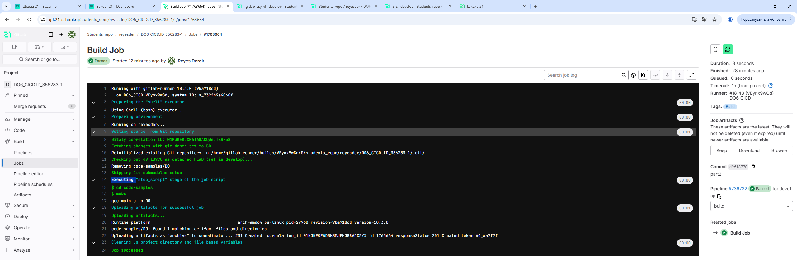

## Часть 3. Тест кодстайла
Напиши этап для CI, который запускает скрипт кодстайла (clang-format).
Если кодстайл не прошел, то «зафейли» пайплайн.
В пайплайне отобрази вывод утилиты clang-format.
Добавил стадию проверки кодстайла
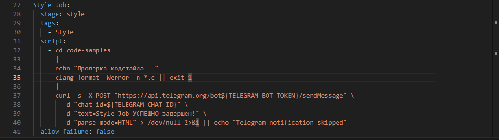

Пайплайн:

Вывод утилиты:
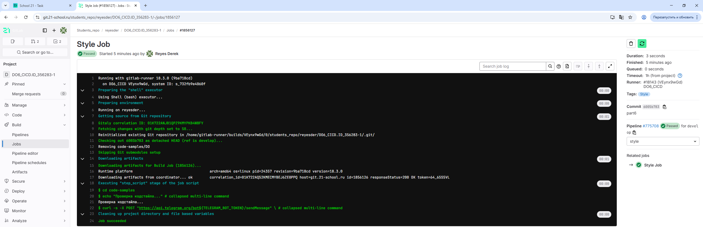

## Часть 4. Интеграционные тесты
Для проекта из папки code-samples напиши интеграционные тесты самостоятельно. Тесты могут быть написаны на любом языке (c, bash, python и т.д.) и должны вызывать собранное приложение для проверки его работоспособности на разных случаях.
Запусти этот этап автоматически только при условии, если сборка и тест кодстайла прошли успешно.
Если тесты не прошли, то «зафейли» пайплайн.
В пайплайне отобрази вывод, что интеграционные тесты успешно прошли / провалились.

Тесты:
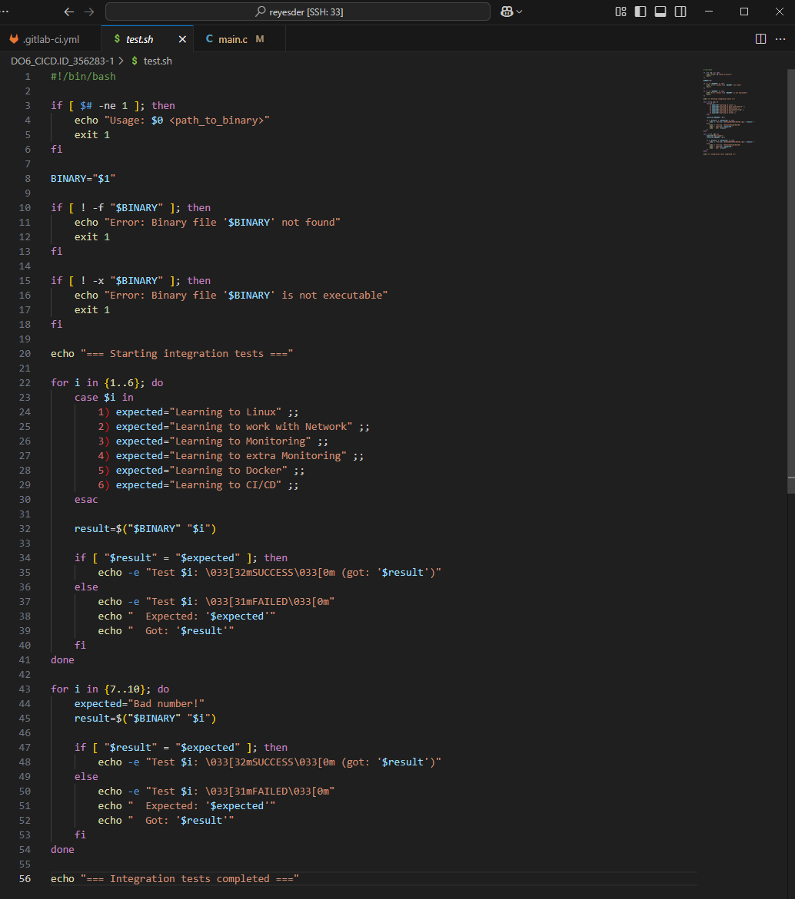

Добавил стадию проверки кодстайла
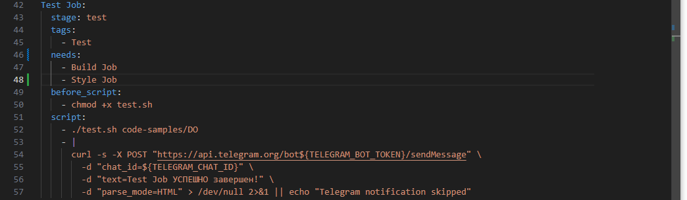

Пайплайн:

Вывод утилиты:
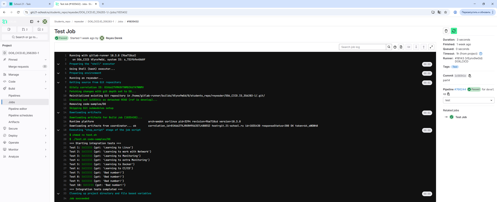

## Часть 5. Этап деплоя
Две виртуальные машины Ubuntu Server 22.04 LTS.
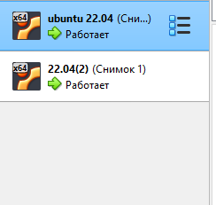

bash-скрипт, который при помощи ssh и scp копирует файлы, полученные после сборки (артефакты), в директорию /usr/local/bin второй виртуальной машины
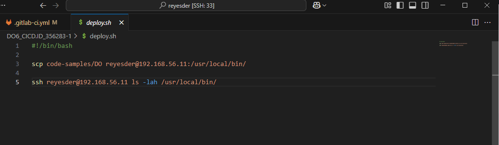

В файле .gitlab-ci.yml добавил этап запуска написанного скрипта:
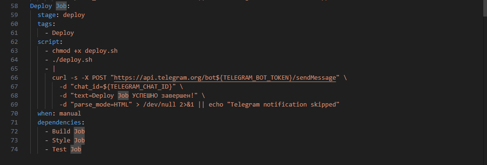

Пайплайн:

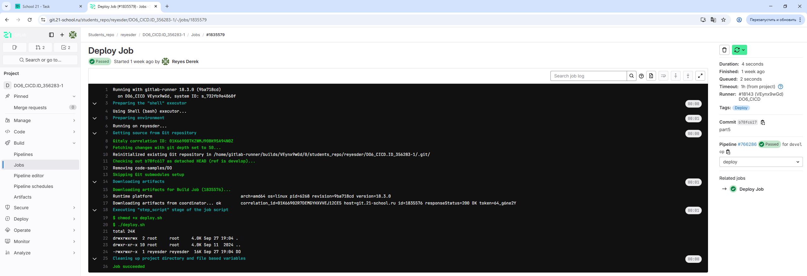

Файл на второй машине:
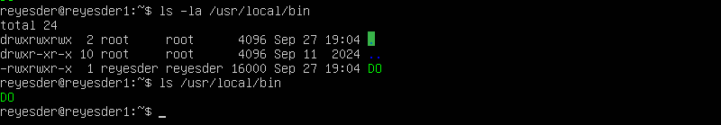

## Часть 6. Дополнительно. Уведомления
Настроил бота:
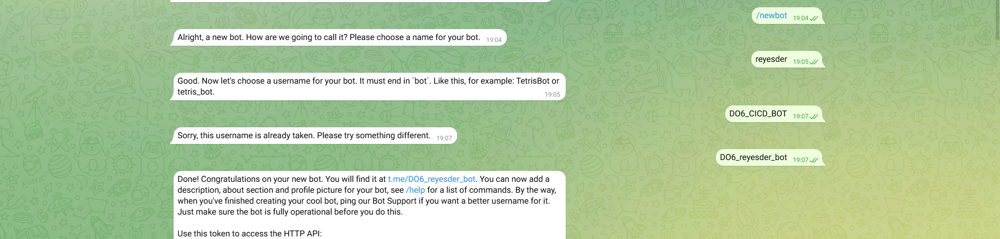

Добавил в .gitlab-ci.yml отправку сообщений об успешных стадиях проекта
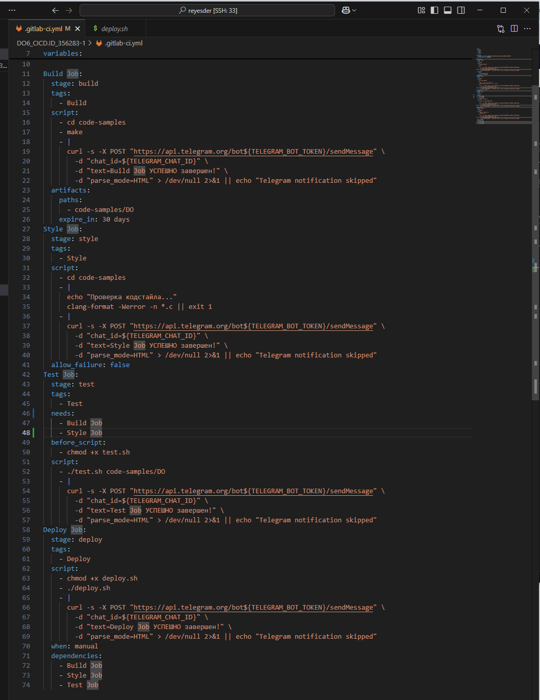

Запустил:
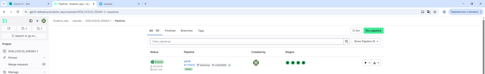

Получил уведомления:
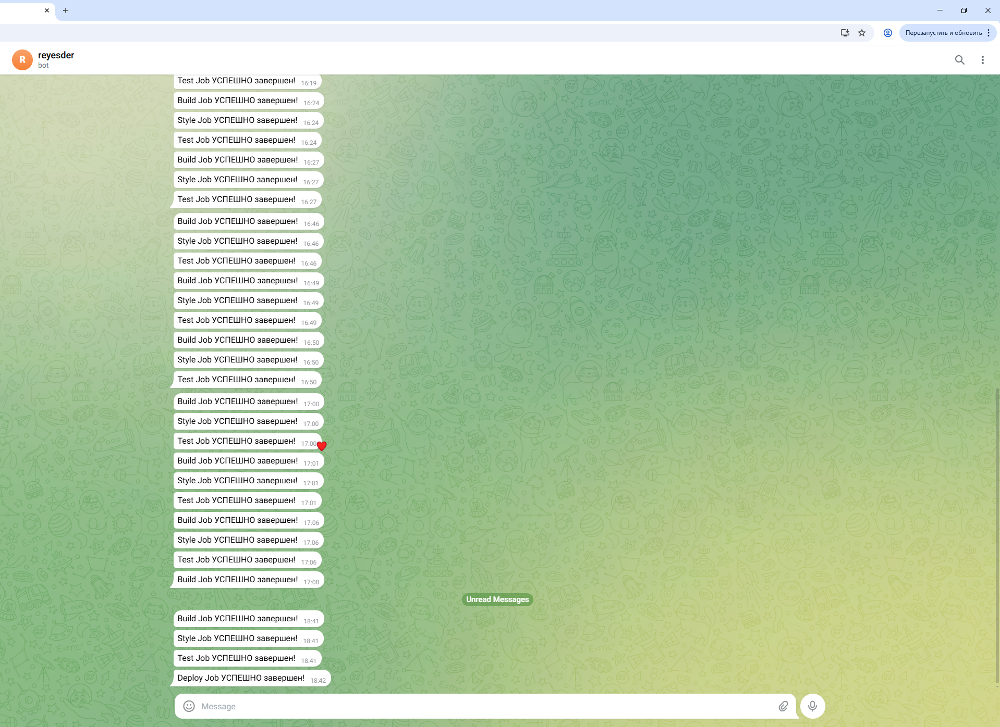